# Medical Images (NIFTI) analizer
I have created a program in python that can be used to process and segmentate 
mediacal images in the NIFTI format.
## Instalation
1. Make sure you have python > 3 installed
2. Clone my repository: https://github.com/EdinsonUwU/seg-python
3. Enter to the folder seg-python-main
```bash
cd seg-python-main
```
2. Create a virtual environment for the project's dependencies
```bash
virtualenv venv
```
3. Activate the just created virtual environment
```bash
source venv/bin/activate
```
4. Install all the dependencies in the environment running:
```bash
pip install -r requirements.txt
```
## Run
To run the program use something like vs code or pycharm (recomended).
If you are in the console run:
```bash
python3 main.py
```
## You can do
* Upload a nifti file
* Draw annotations on a view mode and slice that you can define
* Clear annotations
* Go forth and backwards on all the segmentations you have done
* Change slice
* Change mode (Coronal, Sagital, Axial)
* Look up the state of the segmentation: processing, and finished.
* Run segmentation algorithms: Thresholding, isodata, region growing, k-means
## Screenshots
First image after running the program
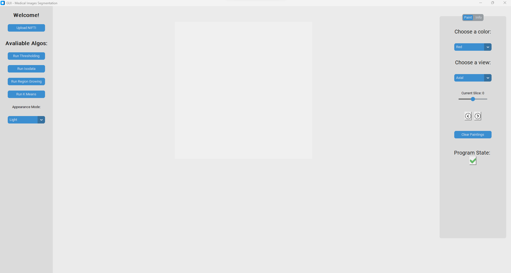
Uploading a Medical Image (nifti file)
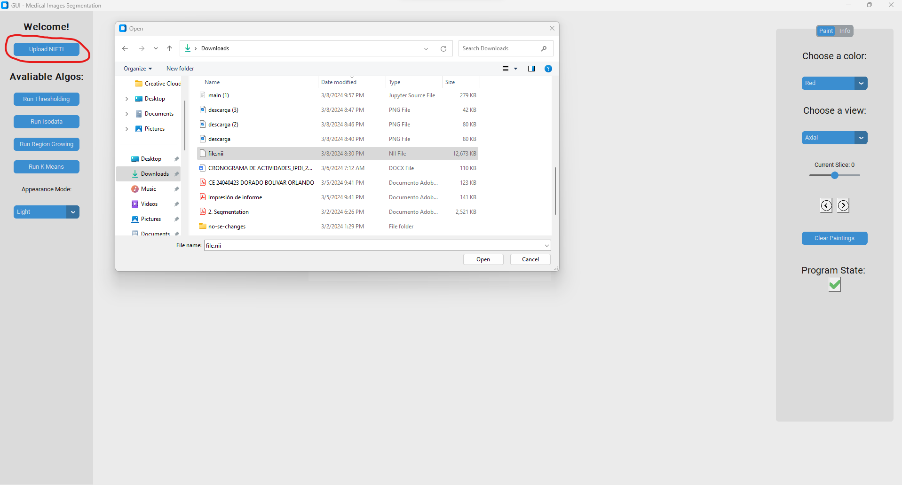
File successfully uploaded

Change between sagital, coronal, axial view, and change the slice
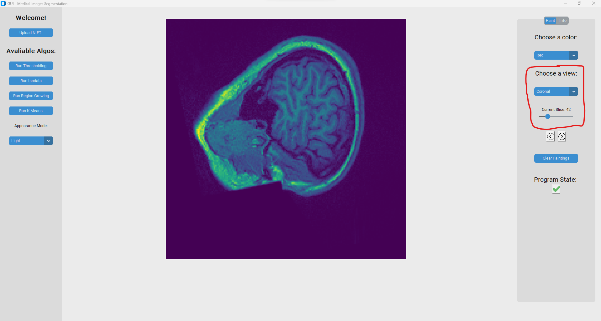
Change color and annotate
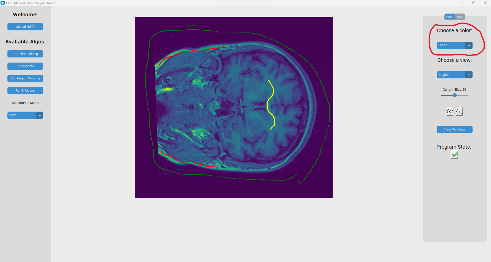
Clear all annotations
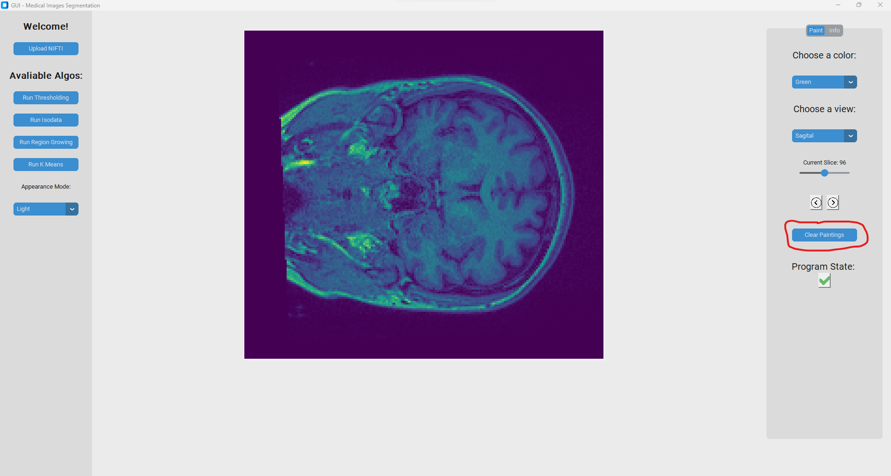
Run thresholding (you have to choose a value to do it)
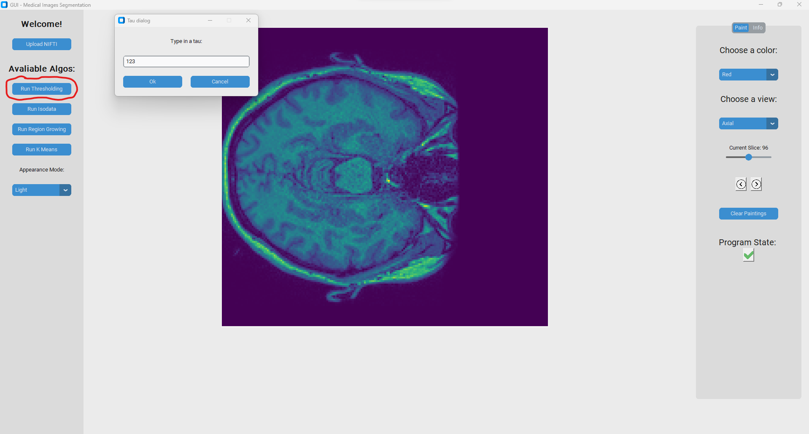

Go back to the prior fdata

Run isodata (Global thresholding)
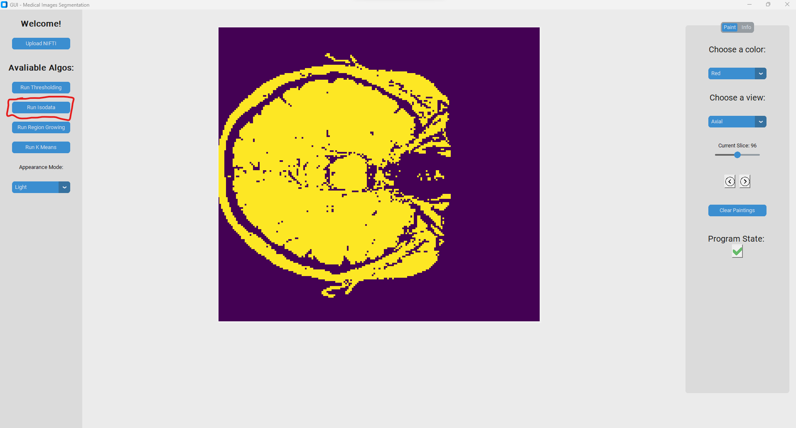
Run k-means (you have to enter the number of clusters you want)

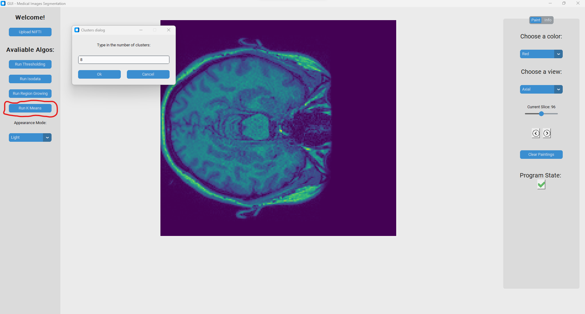
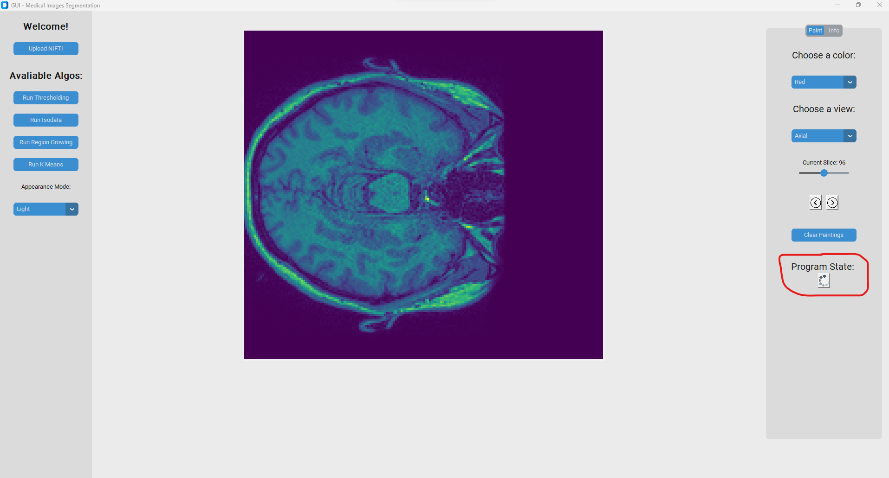
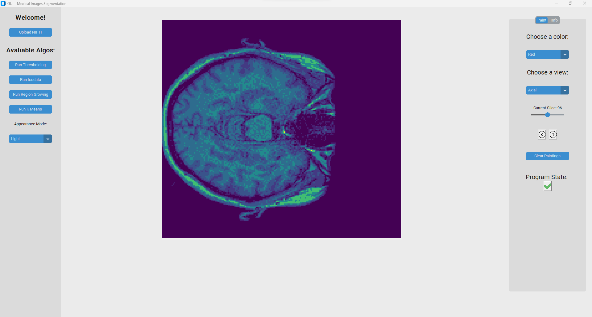
Run Region Growing (you have to annotate the region you want to grow, and 
decide an intensity difference tolerance)
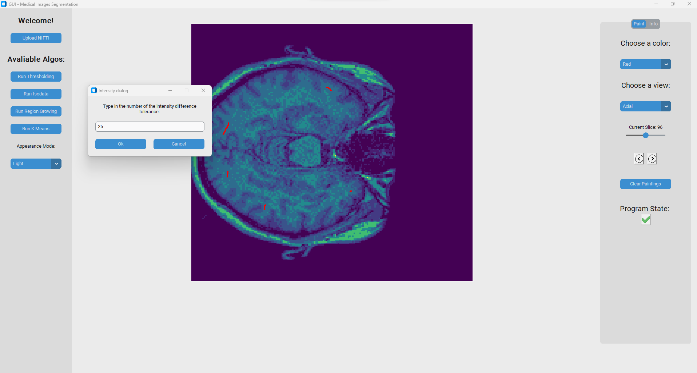
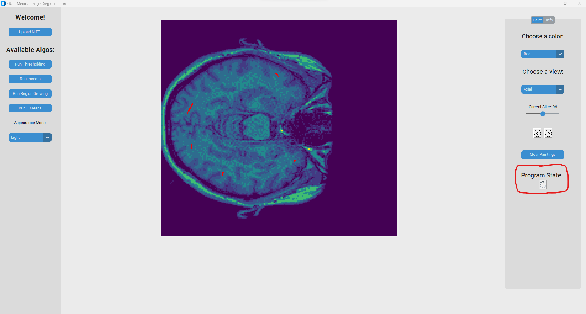
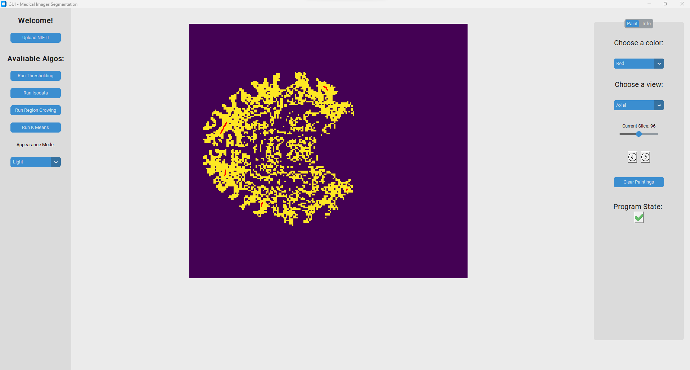
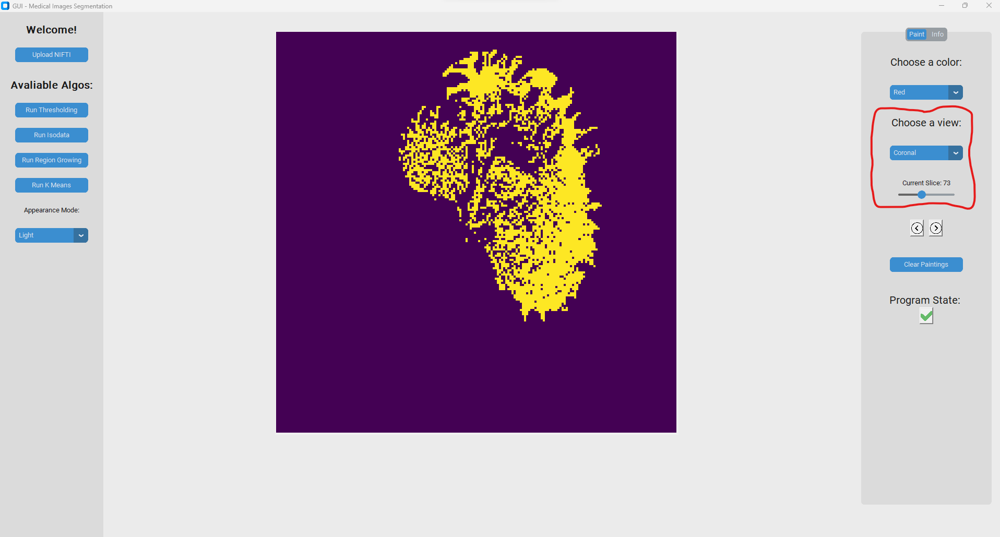

## Libraries
- `customtkinter`: A custom module for enhanced GUI elements.
- `tkinter`: Standard Python interface to the Tk GUI toolkit.
- `PIL`: Python Imaging Library to work with images.
- `Python`: Python version 3.12.0.
- `numpy`: A powerful library for numerical computing.
- `nibabel`: A library for reading and writing neuroimaging data.
- `matplotlib`: A plotting library for creating static, animated, and interactive visualizations in Python.
- `math`: A standard Python library providing mathematical functions and operations.
- `copy`: A module for creating shallow and deep copies of objects in Python.
- `queue`: A module implementing multi-producer, multi-consumer queues in Python, useful for synchronizing producer and consumer threads.